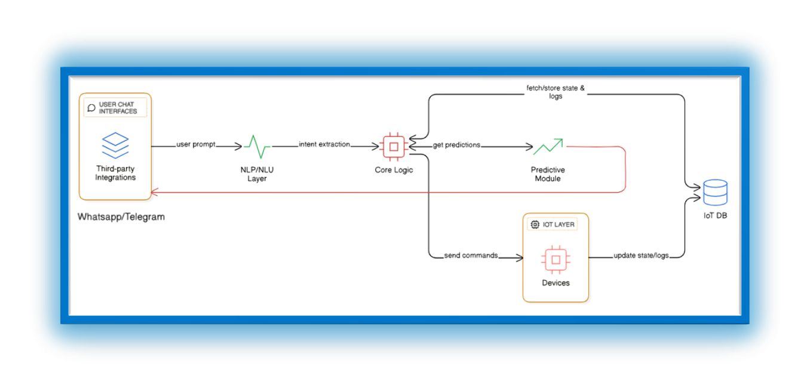

# <picture></picture> Conversational-AI-Agent-for-Smart-IoT-Control
 AI-Powered Conversational Agents for Smart IoT Control, Monitoring, and Predictive Maintenance via Chat Interfaces (Telegram, WhatsApp, Slack). Built with LLMs + MQTT + FastAPI.

---

## <picture></picture> What It Can Do

|  Use Case |  Example |
|------------|------------|
| **Device Control** | "Turn off the greenhouse fan if humidity > 70%" |
| **Real-Time Monitoring** | "What's the current temperature in Zone A?" |
| **Predictive Alerts (Optional)** | "Compressor in Unit 3 may fail in 14 days." |

---

## <picture> </picture> Architecture
 <!-- Replace with your image path or URL -->

---

## <picture></picture> Project Objectives

- **Natural Language Control**  
  Send logical, human-style commands to connected IoT devices.
  
- **Multi-Channel Support**  
  Run on WhatsApp, Slack, or Telegram without any extra interface.

- **Predictive Maintenance (Optional)**  
  Analyze past device logs to forecast future failures and notify users early.

---

## <picture></picture> Tech Stack

| Layer | Tools |
|-------|-------|
| **AI/NLP** | OpenAI GPT-4, Rasa, Dialogflow |
| **Backend** | Python, FastAPI / Flask |
| **IoT Communication** | MQTT, HTTP, Node-RED (optional) |
| **Database** | Firebase, MongoDB |
| **Chat Platforms** | Telegram Bot API, WhatsApp (Twilio), Slack API |
| **[Optional] Predictive ML** | Scikit-learn, TensorFlow |

---

## <picture></picture> Project Outcomes

-  A plug-and-play agent for Telegram/WhatsApp/Slack  
-  Natural language control over connected devices  
-  Real-time sensor data retrieval  
-  Predictive diagnostics (optional add-on)

